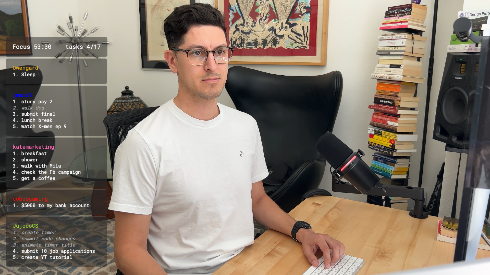
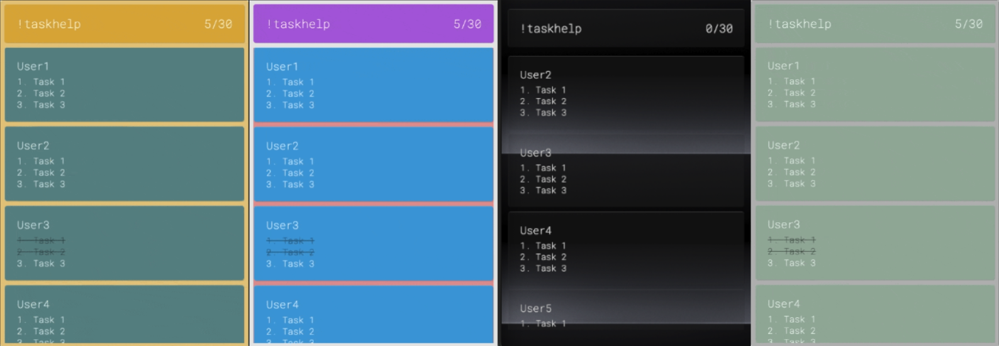
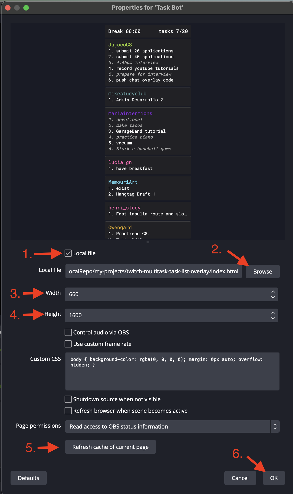

<div align="center">

<br >

</div>

# Twitch Chatbot Multitask Task List Overlay

## What and Why?

A TaskList widget for Twitch TV which allows users to interact with the broadcaster's stream.
Viewers can create, edit, mark as done, and delete tasks from the list. This TaskList widget is designed to help streamers and their viewers to keep track of tasks, goals, or objectives during a stream. It is easy to use, and fast to setup. The TaskList widget is designed to be used in OBS or other streaming software.

## App Features ✨

- Free to use
- Easy setup
- Easy to customize
- Fast performance & super lightweight (19 kB bundle size)
- No coding required
- Customizable Multi-language support
- No third-party database required
- User features
  - user can create multiple tasks
  - user can edit tasks
  - user can mark tasks as done
  - user can delete tasks from their list
- Supports multiple languages translations
  - EN - English
  - ES - Español
  - FR - française
  - JP - 日本語
  - UA - українська
  - DE - German
  - PT_BR - Portuguese (Brazilian)

## Table of Contents

- [Installation Instructions](#installation-instructions)
  - [Download App](#download-app)
  - [Get Twitch oAuth](#get-twitch-oauth)
  - [Setup in OBS](#setup-in-obs)
- [Customization settings](#customization-settings)
  - [App Behavior Settings](#behavior-settings)
  - [Styles Settings](#styles-settings)
- [Commands](#commands)
  - [Commands for Everyone](#commands-for-everyone)
  - [Commands for Broadcasters and Moderators](#commands-for-broadcasters-and-moderators)
- [Aliases](#aliases)
  - [User Commands](#user-commands)
- [Credits](#credits)

## Installation Instructions

### Download App

1. **Downloading this App** - Download App by clicking on the green `Code` button and selecting `Download ZIP`.

2. **Unzip the Download** - Once the download is complete, unzip (aka open) the downloaded file to a location on your computer where you can easily access it and remember where it is.

### Get Twitch oAuth

1. **Log in to Twitch Developer Console**

   - Open and log into [https://dev.twitch.tv/console](https://dev.twitch.tv/console) using your web browser.
   - Log in using your bot account or your main Twitch account.

2. **Register The App with Twitch**

   - Once logged in, Click the **"Register Your Application"** button.
   - Enter a unique name for your application in the **Name** field. (e.g., "TaskListBot123")
   - In the **OAuth Redirect URLs** field, enter `http://localhost`
   - In the **Category** field, select **"Chat Bot"**.
   - For the **Client Type**, select **"Public"**.
   - Click the **"Create"** button to complete the registration.
   - Once the App is registered, you will see a **Client ID**. Copy this ID and save it for later. (do not share this ID with anyone)

3. **Generate an OAuth Access Token**

   - Copy the following URL and replace the `YOUR-APP-CLIENT-ID` with the **Client ID** from your registered app you had made in the previous step.

    ```txt
    https://id.twitch.tv/oauth2/authorize?response_type=token&client_id=YOUR-APP-CLIENT-ID&redirect_uri=http://localhost&scope=chat:read+chat:edit+user:bot
    ```

   - Open your browser and enter the URL containing your **Client ID** into the address bar. See [Twitch Authorize page Example](./images/twitch-authorize.png)
   - After granting Authorization, you'll be redirected to a blank page which will show an error message. This is normal.
   - The blank page will contain a URL in the address bar. This URL contains the access token you need. See [Access Token Example](./images/access-token-page.png)
   - Copy the token from the URL (it follows `#access_token=` and ends just before `&scope`).
   - Save this token in a safe place for the next step.

4. **Update Your \_auth.js File**

   - Navigate to the location where you unzipped the downloaded files.
   - Open the `_auth.js` file in a text editor. (Notepad works, but I recommend downloading VS Code to make it easier to read and edit the file.)
   - Replace `OAUTHTOKEN` with the access token you copied.
   - Replace `USERNAME` with your Twitch main username or bot username.
   - Replace `CHANNEL` with your Twitch channel name.

When you are done, it should look something like this:

```js
twitch_oauth = "138kjl2a0r3dpaf93as4d1fz",
twitch_username = "JujocoBot",
twitch_channel = "Jujoco_Dev",
```

### Setup in OBS

1. **Setup a Browser Source in OBS** - Open OBS and add a new `Browser Source` to your scene. Name it `TaskList overlay` or something you can easily remember.

2. **Select the Local file checkbox** - In the Browser Source settings, select `Local file` and then `Browse` to the location where you unzipped the downloaded files. Select the `index.html` file and click `Open`.

3. **Set the Width and Height** - Next, in the Browser Source, set the width and height. I recommend 660px Width and 1600px Height. Adjust as needed.

4. **Done!** - Select OK to save!. Read the [Customization settings](#customization-settings) section to customize the MultiTask list widget and connect it to your Twitch chat.



## Customization settings

> IMPORTANT! — Any changes you make to the `_auth.js, _settings.js, _styles.js, _configAdmin.js, or _configUser.js` will require you to click the `Refresh Cache of Current Page` button in the Browser Source you just created to apply the changes. (see image above, #6.)

### Behavior Settings

Open the `_settings.js` file and modify the following settings to customized the TaskList behavior. Default values are provided below. If at any point you want to reset the styles to the default values you can find the default values below next to each style name.

`languageCode`: Default = **"EN"**

- **"EN"**: English translation
- **"ES"**: Spanish translation
- **"FR"**: French translation
- **"JP"**: Japanese translation
- **"UA"**: Ukrainian translation
- **"DE"**: German translation
- **"PT_BR"**: Brazilian Portuguese translation
`maxTasksPerUser`: Default = **10**

- **number**: A value between 1 - 20.

`scrollSpeed`: Default = **20**

- **number**: A value between 1 - 50.

`showUsernameColor`: Default = **true**

- **true**: will shows the user's twitch chat color
- **false**: will show the color you set in the `username-color` style

`headerFeature`: Default = "timer"

Enable one will disable the others.

- **"timer"**: Display a timer in the header
- **"text"**: Display a custom text in the header
- **"commands"**: Display commands tips in the header
- **"tasks-only"**: Display only the tasks count in the header

`headerCustomText`: Default = "Custom Text"

HeaderFeature above must be set to "Text"

`botResponsePrefix`: Default = "🤖💬 "

The prefix that the bot will use to respond to the user in the chat.

`testMode`: Default = **false**

- **false**: turn OFF test mode.
- **true**: turn ON test mode.

Use this to test the TaskList without affecting the real task list and visually see the style changes you make. When test mode is OFF, the TaskList will work as normal and remove any test tasks.

### Styles Settings

Open the `_styles.js` file and modify the following settings to customized the TaskList appearance. Default values are provided below. If at any point you want to reset the styles to the default values you can find the default values below next to each style name.

#### Font Family - more available @ <https://fonts.google.com>

- headerFontFamily: "Roboto Mono"
- cardFontFamily: "Roboto Mono"

#### App Styles

- appBorderRadius: Default = **"5px"**
- appPadding: Default = **"8px"**
- appBackgroundImage: Default = **"url(../images/transparent-image.png)"**
- appBackgroundColor: Default = **"rgba(0, 0, 0, 0)"**

#### Header Styles

- headerDisplay: Default = **"flex"**
- headerBorderRadius: Default = **"6px"**
- headerMarginBottom: Default = **"6px"**
- headerBackgroundColor: Default = **"rgba(0, 0, 0, 0.7)"**
- headerFontSize: Default = **"20px"**
- headerFontColor: Default = **"#FFFFFF"**
- headerFontWeight: Default = **"normal"**

#### Card Styles

- cardGapBetween: Default = **"6px"**
- cardBorderRadius: Default = **"6px"**
- cardBackgroundColor: Default = **"rgba(0, 0, 0, 0.7)"**

#### Username Styles

- usernameFontSize: Default = **"18px"**
- usernameColor: Default = **"#FFFFFF"**
- usernameFontWeight: Default = **"normal"**

#### Task Styles

- taskFontSize: Default = **"16px"**
- taskFontColor: Default = **"#FFFFFF"**
- taskFontWeight: Default = **"normal"**
- taskDoneFontColor: Default = **"#aaaaaa"**
- taskDoneFontStyle: Default = **"#italic"**
- taskDoneTextDecoration: Default = **"line-through"**
- taskFocusFontColor: Default = **"#111111"**
- taskFocusBackgroundColor: Default = **"rgba(255, 255, 255, 0.7)"**
- taskFocusBorderRadius: Default = **"8px"**

## Commands

### Commands for Everyone

- `!task` or `!add` - Add task(s) (multiple tasks must be separated by a comma)

  - example: `!task read ch. 3`
  - example: `!task prep for exam, walk dog`

- `!focus` - Focus on a specific task

  - example: `!focus 1`
  - example: `!focus 3`

- `!edit` - Edit a single task

  - example: `!edit 1 read ch. 4`
  - example: `!edit 2 walk cat`

- `!done` - Mark task(s) as done (multiple tasks must be separated by a comma)

  - example: `!done 1`
  - example: `!done 2, 3`

- `!delete` - Delete task(s) (multiple tasks must be separated by a comma)

  - example: `!delete 1`
  - example: `!delete 2, 3`

- `!check` - Check your remaining tasks

  - example: `!check`

- `!credit` - Show the credits

  - example: `!credit`

### Commands for Broadcasters and Moderators

- `!timer` - Set the focus and break timer for a session (in minutes)

  - example: `!timer 60/10`
  - example: `!timer 90/15`

- `!clearlist` - Clear all tasks from the list

  - example: `!clearlist`

- `!cleardone` - Clear all done tasks

  - example: `!cleardone`

- `!clearuser` - Remove all tasks from a User (username case insensitive)

  - example: `!clearuser jujoco_dev` or `Jujoco_Dev`

## Aliases

### User Commands

**add task commands:**

- `!task`
- `!añadir` (Spanish)
- `!ajouter` (French)
- `!追加` (Japanese)
- `!додати` (Ukrainian)
- `!aufgabe` (German)
- `!tarefa` (Brazilian Portuguese)

**focus commands:**

- `!focus`
- `!enfocar` (Spanish)
- `!concentrer` (French)
- `!集中` (Japanese)
- `!фокус` (Ukrainian)
- `!fokus` (German)
- `!focar` (Brazilian Portuguese)

**edit task commands:**

- `!edit`
- `!editar` (Spanish)
- `!modifier` (French)
- `!編集` (Japanese)
- `!редагувати` (Ukrainian)
- `!bearbeiten` (German)
- `!editar` (Brazilian Portuguese)

**complete task commands:**

- `!done`
- `!hecho` (Spanish)
- `!terminé` (French)
- `!完了` (Japanese)
- `!готово` (Ukrainian)
- `!erledigt` (German)
- `!completo` (Brazilian Portuguese)

**delete task commands:**

- `!delete`
- `!eliminar` (Spanish)
- `!supprimer` (French)
- `!削除` (Japanese)
- `!видалити` (Ukrainian)
- `!löschen` (German)
- `!deletar` (Brazilian Portuguese)

**check commands:**

- `!check`
- `!comprobar` (Spanish)
- `!vérifier` (French)
- `!チェック` (Japanese)
- `!перевірити` (Ukrainian)
- `!prüfen` (German)
- `!verificar` (Brazilian Portuguese)

**help commands:**

- `!help`
- `!ayuda` (Spanish)
- `!aide` (French)
- `!ヘルプ` (Japanese)
- `!допомога` (Ukrainian)
- `!hilfe` (German)
- `!ajuda` (Brazilian Portuguese)

**extra commands:**

- `!credit`
- `!crédito` (Spanish)
- `!crédit` (French)
- `!クレジット` (Japanese)
- `!кредит` (Ukrainian)
- `!kontakt` (German)
- `!crédito` (Brazilian Portuguese)

## Credits

**Author:** [**@Jujoco_Dev**](https://twitch.tv/Jujoco_Dev)
