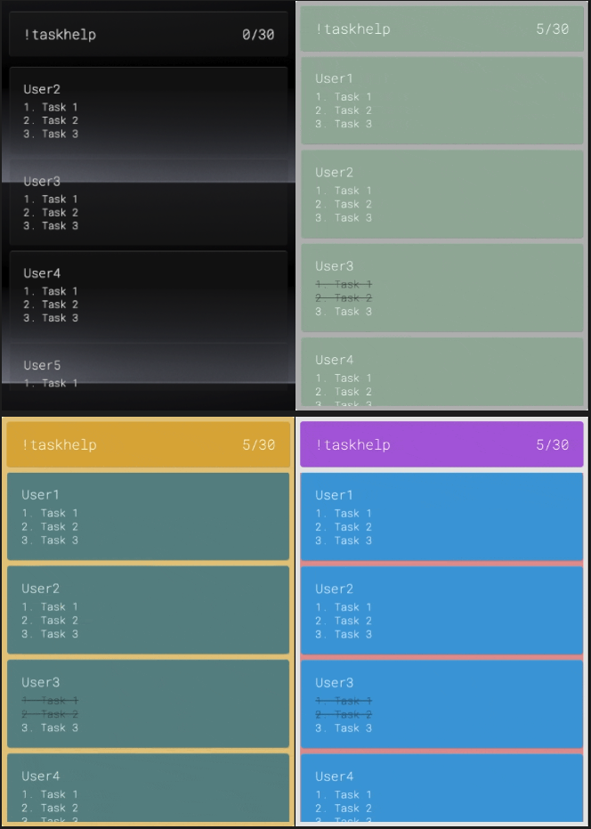

# Twitch Multi-Task Chat Bot



## What and Why?

A simple chat bot that allows users to interact with your stream.
Viewers can create, edit, mark as done, and delete tasks from the list. This bot is designed to help streamers and their viewers to keep track of tasks, goals, or objectives during a stream. The bot is designed to be simple, easy to use, and fast to setup. The bot is designed to be used in OBS or other streaming software as a Browser Source.

## **APP Features ✨**

-   Free to use
-   Easy setup
-   Easy to customize
-   Fast performance
-   No coding required
-   Customizable Multi-language support
-   No third-party database required
-   User features
    -   user can create multiple tasks
    -   user can edit tasks
    -   user can mark tasks as done
    -   user can delete tasks from their list
-   Supports multiple languages translations
    -   EN - English
    -   ES - Español
    -   FR - française
    -   JP - 日本語

## Content

-   [Installation](#installation)
-   [Customization settings](#customization-settings)
    -   [Behavior Settings](#behavior-settings)
    -   [Styles Settings](#styles-settings)
    -   [Fonts Styles](#fonts-styles)
    -   [App Styles](#app-styles)
    -   [Header Styles](#header-styles)
    -   [Body Styles](#body-styles)
    -   [Card Styles (individual cards)](#card-styles-individual-cards)
-   [Commands](#commands)
    -   [Commands for Everyone](#commands-for-everyone)
    -   [Commands for Broadcasters and Moderators](#commands-for-broadcasters-and-moderators)
-   [Aliases](#aliases)
-   [Credits](#credits)

## Installation

Download this repo and Add & Setup a `Browser Source` in your OBS or other streaming software with the local file source pointing to `index.html` in this repo.

## Customization settings

Open the `configs.js` file and modify the following settings to customized the TaskBot Behavior & Appearance.

### Twitch oAuth - Required

1. Get auth token from https://twitchapps.com/tmi
2. open `configs.js` file
3. Replace `OAUTH_HERE` with your token
4. Replace `CHANNEL_HERE` with your channel name
5. Replace `USERNAME_HERE` with your username — in most cases it is the same as your channel name.

```js
twitch_oauth = "OAUTH_HERE";
twitch_channel = "CHANNEL_HERE",
twitch_username = "USERNAME_HERE",
```

### Behavior Settings

`languageCode`: default **EN**

-   **EN**: English translation
-   **ES**: Spanish translation
-   **FR**: French translation
-   **JP**: Japanese translation

`maxTasksPerUser`: default **5**

-   **number**: A value between 1 - 10.

`scrollSpeed`: default **50**

-   **number**: A value between 1 - 100.

`crossTasksOnDone`: default **true**

-   **true**: cross the tasks when they are marked as done
-   **false**: don't cross the tasks when they are marked as done

`showUsernameColor`: default **true**

-   **true**: will shows the user's twitch chat color
-   **false**: will show the color you set in the `username-color` style

`testMode`: default **false**

-   **false**: turn OFF test mode.
-   **true**: turn ON test mode.

### Styles Settings

**Font Family** - selection available @ https://fonts.google.com

-   headerFontFamily: "Roboto Mono",
-   cardFontFamily: "Roboto Mono",

**App Styles**

-   appBorderRadius:
-   appPadding
-   appBackgroundImage
-   appBackgroundColor

**Header Styles**

-   headerBorderRadius
-   headerMarginBottom
-   headerBackgroundColor
-   headerFontSize
-   headerFontColor
-   headerFontWeight

**Body Styles**

-   bodyBackgroundColor

**Card Styles**

-   cardGapBetween
-   cardBorderRadius
-   cardBackgroundColor

**Username Styles**

-   usernameFontSize
-   usernameColor
-   usernameFontWeight

**Task Styles**

-   taskFontSize
-   taskFontColor
-   taskFontWeight
-   taskDoneFontColor

## Commands

### Commands for Everyone

-   !taskadd \<task\> , \<task\> - Add a task or multiple tasks by comma separated
-   !taskedit \<number\> \<newTask\> - Edit a single task
-   !taskdone \<number\> - Mark a single task as done
-   !taskdelete \<number\> - Delete a single task
-   !taskcheck - Check your unfinished tasks

### Commands for Broadcasters and Moderators

-   !adminclearall - Clear all tasks
-   !admincleardone - Clear all done tasks
-   !adminclearuser \<username\> - Remove all tasks from a user

For aliases, see [here](#aliases)

## Aliases

### User Commands

**add task commands:\*\*\*\***

-   `!addtask`
-   `!add`
-   `!task`
-   `!taskadd`

**edit task commands:**

-   `!edit`
-   `!taskedit`
-   `!edittask`

**complete task commands:**

-   `!done`
-   `!donetask`
-   `!taskdone`

**delete task commands:**

-   `!delete`
-   `!taskdelete`
-   `!deletetask`

**check commands:**

-   `!check`
-   `!mytasks`

**help commands:**

-   `!help`
-   `!taskhelp`
-   `!helptask`

### Admin Commands

**admin clear User commands:** \(clear all tasks from a user\) \(mods only\)

-   `!adminclearuser`

**admin clear done commands:** \(clear all done tasks from list\) \(mods only\)

-   `!admincleardone`

**admin clear all commands:** \(clear all tasks from list\) \(mods only\)

-   `!adminclearall`

## Credits

**Author:** [**@JujocoCS**](https://twitch.tv/JujocoCS)

**Inspired by:** [**@RythonDev**](https://twitch.tv/RythonDev) & [**@MohFocus**](https://twitch.tv/MohFocus)
